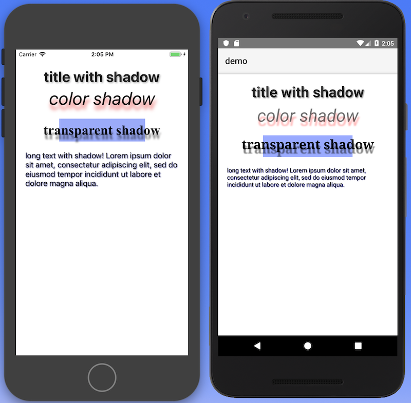
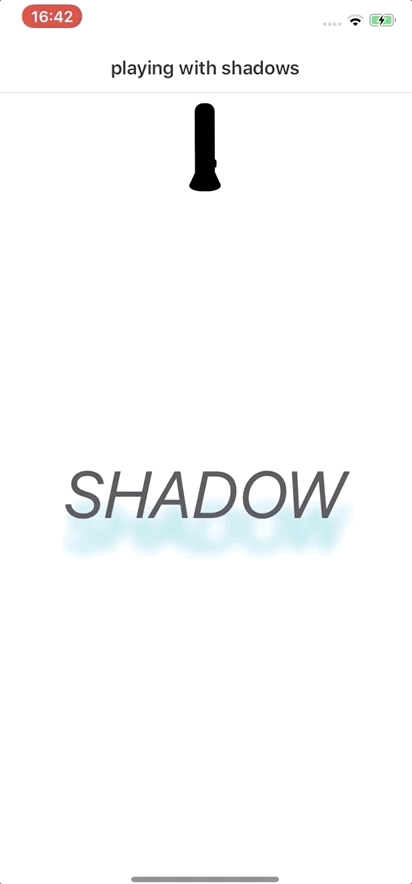

# @tralves/shadowed-label

<a href="https://www.npmjs.com/package/@tralves/shadowed-label">
    
</a>
<a href="https://www.npmjs.com/package/@tralves/shadowed-label">
    
</a>
<a href="https://github.com/tralves/@tralves/shadowed-label/stargazers">
    
</a>
<a href="https://paypal.me/tralves">
    
</a>

A NativeScript plugin that extends the `<Label>` UI widget by adding the `text-shadow` CSS property.

> This package only works on NativeScript >=7.0. You will find the NS 6 version [here](https://github.com/tralves/nativescript-shadowed-label);

| shadow examples                     | sample from the [playground](https://play.nativescript.org/?template=play-vue&id=roCIm3) |
| ----------------------------------- | ---------------------------------------------------------------------------------------- |
|  |                                                      |

## Installation

```bash
ns plugin add @tralves/shadowed-label
```

## Usage

After installing the plugin, you can add the shadow to the shadowed label with the CSS syntax:

`text-shadow: <offset-x> <offset-y> <blur-radius> <color>`

E.g.

```css
.shadow1 {
    text-shadow: 1 1 3 blue;
}

.shadow2 {
    text-shadow: 10px 10px 10px rgba(100, 130, 200, 0.8);
}
```

You can also add the text shadow as a property (e.g. `<ShadowedLabel textShadow="1 1 1 #55a">`)

_iOS note: The blur radius appears to scatter the shadow more on iOS and on Android._

### NativeScript Plain

<span style="color:red">IMPORTANT: </span>_Make sure you include `xmlns:ui="@tralves/shadowed-label"` on the Page element_

#### XML

```xml
<Page xmlns="http://schemas.nativescript.org/tns.xsd" xmlns:ui="@tralves/shadowed-label">
  <StackLayout class="p-20">
    <ui:ShadowedLabel
      class="h1 text-center"
      text="title with CSS shadow"
    />
    <ui:ShadowedLabel
      text="color shadow"
      textShadow="2 10 4 rgb(255, 100, 100)"
      fontStyle="italic"
      fontSize="40"
      class="m-b-20 text-center"
    />
    <ui:ShadowedLabel
      class="m-t-20 c-black"
      style="text-shadow: 1 1 1 #55a"
      textWrap="true"
      text="Shadow in 'style'!"
    />
  </GridLayout>
</Page>
```

#### CSS

```css
.h1 {
    text-shadow: 2 2 2 #aaa;
    font-weight: bold;
}
```

---

### NativeScript Angular

Add the following lines to app/app.module.ts:

```typescript
import { registerElement } from '@nativescript/angular';
import { ShadowedLabel } from '@tralves/shadowed-label'; 

registerElement('ShadowedLabel', () => ShadowedLabel);
```

```html
<ShadowedLabel
    row="0"
    class="h1 text-center"
    text="title with shadow"
    textShadow="0 0 6 rgb(100, 100, 200)"
></ShadowedLabel>
<ShadowedLabel
    row="1"
    text="color shadow"
    textShadow="2 10 4 rgb(255, 100, 100)"
    fontStyle="italic"
    fontSize="40"
    class="m-b-20 text-center"
></ShadowedLabel>
```

---

### NativeScript Vue

```javascript
import Vue from 'nativescript-vue';
Vue.registerElement('ShadowedLabel', () => require('@tralves/shadowed-label').ShadowedLabel);
```

```html
<shadowed-label
    text="color shadow"
    textShadow="2 10 4 rgb(255, 100, 100)"
    fontStyle="italic"
    fontSize="40"
    class="m-b-20 text-center"
/>
```

## License

Apache License Version 2.0
